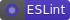
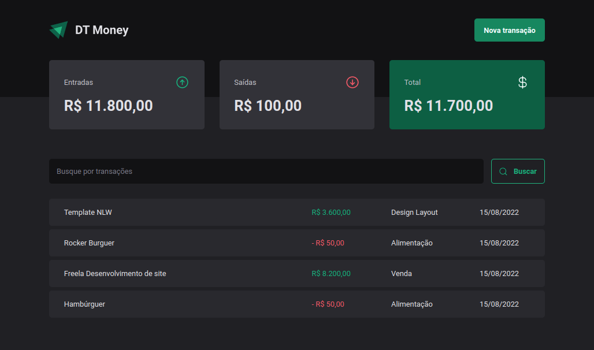
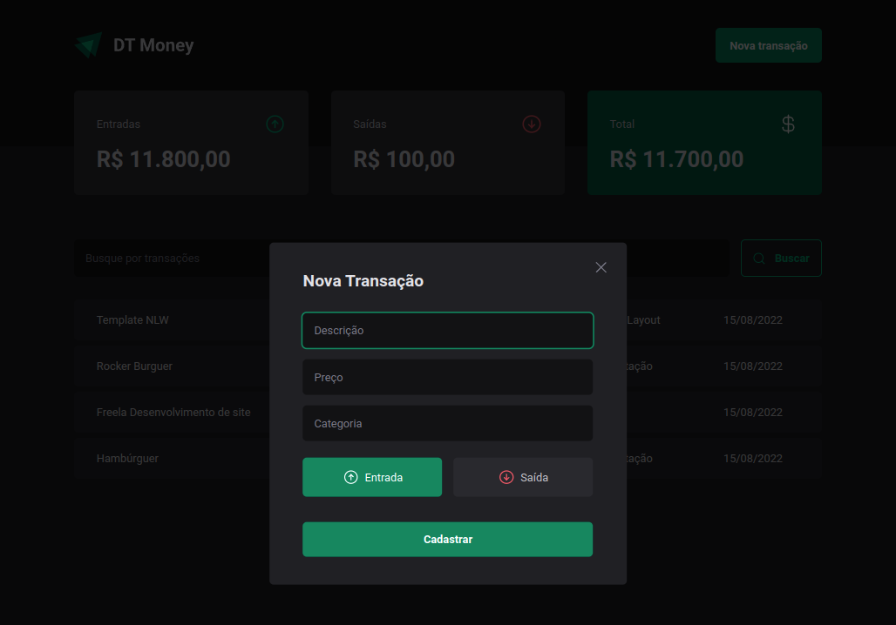
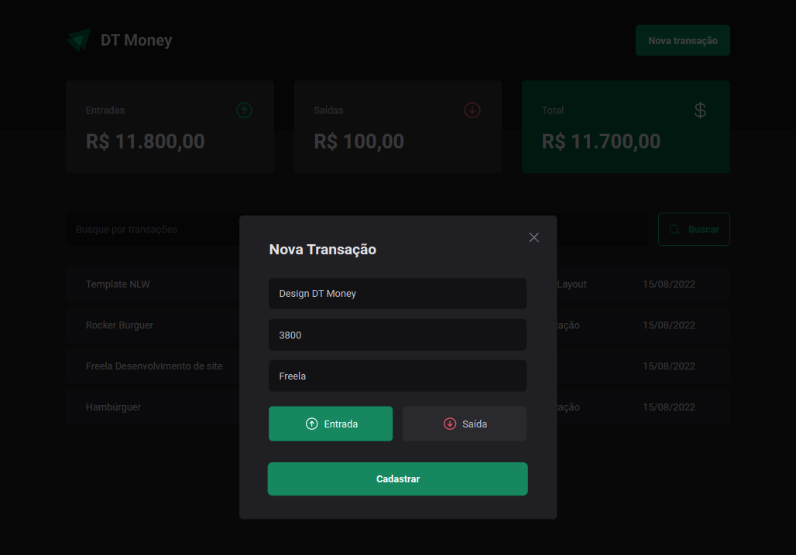
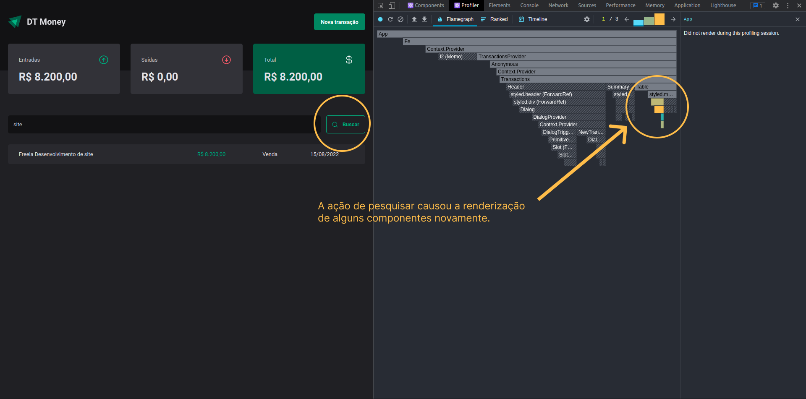
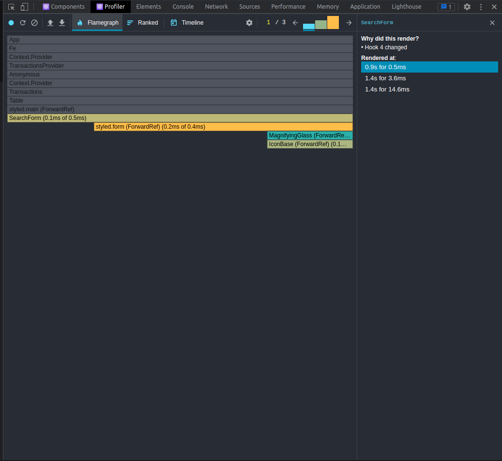

<div align="center">
    
</div>

<div align="center">
    
</div>

<h2 align="center">
   DT Money | 
</h2>

<p align="center">
  
  
  
  
  
  
  
</p>

---

## 💻 Projeto

O dt-money é um aplicativo simples para controle financeiro, desenvolvido durante o Ignite da Rocketseat.

**Tabela com lista de transação, resumo de entradas e saídas**

<div align="center">
    
</div>

**Formulário vazio para adicionar uma nova transação**

<div align="center">
    
</div>

**Formulário preenchido**

<div align="center">
    
</div>

## 🧭 Como rodar o projeto

**Clone este repositório**

```bash
git clone https://github.com/vitorsemidio-dev/dt-money-vite
```

**Instale as dependências**

```bash
npm install
```

**Rode api-fake**

```bash
npm run dev:server
```

**Rode o projeto DT Money**

```bash
npm run dev
```

- Acesse o front da aplicação em [http://localhost:5173](http://localhost:5173)
- A api fake ficará disponível em [http://localhost:3333/transactions](http://localhost:3333/transactions)

## 🔖 Layout

Você pode visualizar o layout do projeto através [desse link](https://www.figma.com/community/file/1138814493269096792). É necessário ter conta no [Figma](https://figma.com) para acessá-lo.


## 🚀 Tecnologias

O projeto foi desenvolvido com as seguintes tecnologias:

- [Axios](https://axios-http.com/)
- [ESLint](https://eslint.org/)
- [Json Server](https://github.com/typicode/json-server)
- [Radix UI](https://www.radix-ui.com/)
- [React](https://pt-br.reactjs.org/)
- [React Developer Tools](https://chrome.google.com/webstore/detail/react-developer-tools/fmkadmapgofadopljbjfkapdkoienihi)
- [Rocketseat eslint-config](https://github.com/Rocketseat/eslint-config-rocketseat)
- [Styled Components](https://styled-components.com/)
- [Typescript](https://www.typescriptlang.org/)
- [use-context-selector](https://www.npmjs.com/package/use-context-selector)
- [ViteJS](https://vitejs.dev/)
- [Visual Studio Code](https://code.visualstudio.com/)
- [Zod](https://zod.dev/)

### 📸 React Developer Tools

Medindo performance da aplicação com `React Developer Tools`.

<div align="center">
    
</div>

<div align="center">
    
</div>
